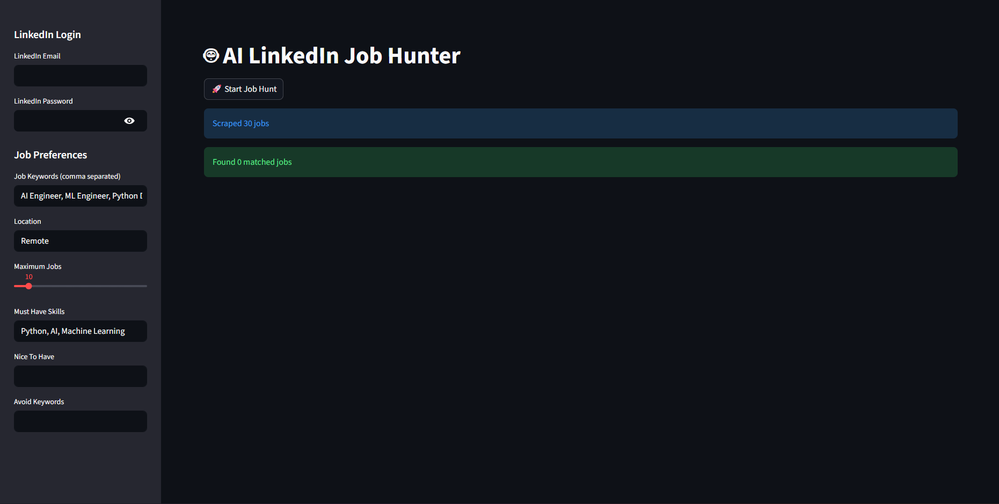

# 🚀 AI LinkedIn Job Hunter

An AI-powered job discovery platform that automates LinkedIn job searching, extracts relevant opportunities, and filters them using LLM-based relevance analysis.

Built using Python, Playwright, Streamlit, and Groq LLM.

---

## 📸 Screenshots

### Dashboard


### Job Preferences



---

# ✨ Features

### 🔍 Automated LinkedIn Job Discovery

* Searches LinkedIn jobs automatically
* Supports multiple job keywords
* Location-based filtering
* Remote job search support
* Persistent authenticated sessions

### 🤖 AI-Powered Job Filtering

* Uses Groq LLM for job relevance analysis
* Matches opportunities against:

  * Must-have skills
  * Nice-to-have skills
  * Avoid keywords
* Intelligent relevance scoring

### 📊 Streamlit Dashboard

* Interactive web interface
* Real-time scraping workflow
* User-defined search preferences
* Job search analytics

### ⚡ Browser Automation

* Playwright-based scraping engine
* Session persistence support
* Async scraping architecture
* Multi-keyword search capability

---

# 🏗️ System Architecture

```text
                    ┌──────────────────┐
                    │   LinkedIn Jobs  │
                    └─────────┬────────┘
                              │
                              ▼
                    ┌──────────────────┐
                    │ Playwright       │
                    │ Job Scraper      │
                    └─────────┬────────┘
                              │
                              ▼
                    ┌──────────────────┐
                    │ Job Extraction   │
                    │ & Processing     │
                    └─────────┬────────┘
                              │
                              ▼
                    ┌──────────────────┐
                    │ Groq LLM         │
                    │ AI Filtering     │
                    └─────────┬────────┘
                              │
                              ▼
                    ┌──────────────────┐
                    │ Streamlit UI     │
                    │ Dashboard        │
                    └──────────────────┘
```

---

# 📂 Project Structure

```text
linkedin-job-agent/
│
├── ai/
│   └── job_filter.py
│
├── scraper/
│   └── linkedin_scraper.py
│
├── storage/
│   └── db.py
│
├── streamlit_app.py
├── main.py
├── requirements.txt
├── README.md
└── .gitignore
```

---

# 🛠️ Tech Stack

| Category           | Technology |
| ------------------ | ---------- |
| Language           | Python     |
| Frontend           | Streamlit  |
| Browser Automation | Playwright |
| AI/LLM             | Groq       |
| Database           | SQLite     |
| Async Processing   | Asyncio    |

---

# ⚙️ Installation

## Clone Repository

```bash
git clone https://github.com/Suryansh9369/Linkedin-job-agent.git
cd Linkedin-job-agent
```

## Create Virtual Environment

```bash
python -m venv .venv
```

### Windows

```bash
.venv\Scripts\activate
```

### Linux/Mac

```bash
source .venv/bin/activate
```

## Install Dependencies

```bash
pip install -r requirements.txt
```

## Install Playwright

```bash
playwright install
```

---

# 🔑 Environment Variables

Create a `.env` file:

```env
GROQ_API_KEY=your_groq_api_key
LINKEDIN_EMAIL=your_email
LINKEDIN_PASSWORD=your_password
```

---

# ▶️ Run Application

```bash
streamlit run streamlit_app.py
```

Then open:

```text
http://localhost:8501
```

---

# 📋 Usage

1. Enter search keywords
2. Select location
3. Add must-have skills
4. Add preferred skills
5. Add avoid keywords
6. Click **Start Job Hunt**
7. Review AI-filtered opportunities

---

# 🔒 Security

* Secrets are stored locally in `.env`
* Session data is stored locally
* `.env` and session folders are excluded from GitHub
* Credentials are never committed to the repository

---

# 🚀 Future Improvements

* Job match score visualization
* CSV export
* Resume-based job matching
* Multi-platform support
* Job analytics dashboard
* User authentication
* Cloud deployment

---

# 📄 License

MIT License

---

# 👨‍💻 Author

**Suryansh Vishwakarma**

B.Tech CSE (AI & ML)

Interests:

* Artificial Intelligence
* Robotics
* Automation Engineering
* Agentic AI Systems
